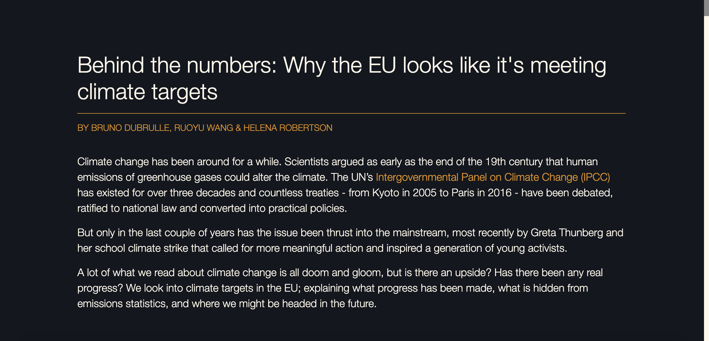

# BEHIND THE NUMBERS: WHY THE EU LOOKS LIKE IT'S MEETING ITS CLIMATE TARGETS

### VIEW THE PROJECT
Our project is avaiable at the following link: (https://compjcdf.github.io/climate-kidz/)

### WHAT YOU SHOULD SEE
On following the link to our project, you should see a page like the one below: 

## PROJECT DESCRIPTION

### INTRODUCTION

This website was conceived as a project for the  Digital Investigation module (2019 - 2020) in the MSc. Computational and Data Journalism at Cardiff University.

Its aim is to put into context to what extent and how the EU is meeting its climate targets. We'll be taking a closer look at emission targets, the calculation of greenhouse gas emissions and what climate neutrality (and the transition towards it), projected by 2050, might look like.  

## METHODOLOGY, DATA AND SOURCES
This project was conceived both as a journalistic and software project and therefore combines a broad range of methods, ranging from data and emissions analysis to taking interviews and studying academic papers. 

All data sources used for charts and photo credits are linked within our project, but below we have consolidated all our sources, including those that aided our research and inspired the presentation of the final piece:

#### Scrollytelling line chart with text snippets about EU climate targets 
* [Climate Action Tracker: EU climate targets past and present](https://climateactiontracker.org/countries/eu/)
* [European Commission policy documents on climate targets](https://ec.europa.eu/clima/policies/strategies/2030_en)
* [Ursula von der Leyen speech before EU Parliament](https://ec.europa.eu/commission/presscorner/detail/en/speech_19_6751)
* [UN Intergovernmental Panel on Climate Change (IPCC)](https://www.ipcc.ch/)
* [European Green Deal](https://ec.europa.eu/info/strategy/priorities-2019-2024/european-green-deal_en)
* [Economist article on the EU Green Deal](https://www.economist.com/europe/2019/12/14/the-eus-green-deal-is-full-of-ambition-but-needs-more-detail)
* [The EU Commission proposes new 2030 target of at least 50% emissions reduction](https://ec.europa.eu/info/law/better-regulation/have-your-say/initiatives/12265-2030-Climate-Target-Plan)
* [Brexit & Environment (network of independent researchers)](https://www.brexitenvironment.co.uk/category/policy/climate-change/)

#### Can the EU meet its 2030 target? Interactive tool 
* [EEA EU Member States’ emissions projections under current policy](https://www.eea.europa.eu/data-and-maps/data/greenhouse-gas-emission-projections-for-6)
* [EU Member States’ historical emissions data](https://www.eea.europa.eu/data-and-maps/data/data-viewers/greenhouse-gases-viewer)

#### What’s included in emissions statistics ?
* Following a T-shirt’s production chain:
    * [World Bank UK Textiles & Clothing Imports By Country 2018](https://wits.worldbank.org/CountryProfile/en/Country/GBR/Year/LTST/TradeFlow/Import/Partner/by-country/Product/50-63_TextCloth)
    * [Apparel Business Systems: The Life of a Garment, from Seed to Sale](https://www.apparelbusiness.com/the-life-of-a-garment-from-seed-to-sale-6-steps-in-the-fashion-supply-chain/)
    * [ESGROBO: Where Do Our Clothes Come From?](https://esgrobot.com/where-do-our-clothes-come-from/)
    * [Women Working Worldwide: Guide to Garment Industry Supply Chains](http://www.yorku.ca/rajagopa/documents/garmentsuppchain-www_education_pack.pdf)
* [Sustainability Research Institute, University of Leeds: UK clothing industry consumption emissions data](http://www.emissions.leeds.ac.uk/chart2.html)

#### Creative carbon accounting
* [The Economist on Creative Carbon Accounting](https://www.economist.com/finance-and-economics/2019/10/17/greta-thunberg-accuses-rich-countries-of-creative-carbon-accounting)
* [The Guardian on Creative Carbon Accounting](https://www.theguardian.com/environment/2019/apr/25/uks-creative-carbon-accounting-breaches-climate-deal-say-critics)
* [Carbon Brief: Mapped: How ‘embodied’ footprints compare across Europe](https://www.carbonbrief.org/mapped-how-embodied-carbon-footprints-compare-across-europe)
* [World Economic Forum: Emissions inequality](https://www.weforum.org/agenda/2019/04/emissions-inequality-there-is-a-gulf-between-global-rich-and-poor)
* [Carbon-CAP: Consumption-based accounting](https://www.carboncap.eu/results)
* [Sustainability Research Institute, University of Leeds: Overall UK consumption data & territorial emissions](http://www.emissions.leeds.ac.uk/chart1.html)
* [PNAS Journal article: Peters et al. (2011) Growth in emission transfers via international trade from 1990 to 2008](https://www.pnas.org/content/pnas/108/21/8903.full.pdf)
* [Our World in Data, University of Oxford: Greenhouse gas emissions embedded in trade](https://ourworldindata.org/co2-and-other-greenhouse-gas-emissions#co2-embedded-in-trade)
* [Global Carbon Project Research Paper: A synthesis of carbon in international trade](https://www.biogeosciences.net/9/3247/2012/bg-9-3247-2012.pdf)

#### How do we achieve climate neutrality?
* [Philip Jones’ Solcer House Project](https://www.cardiff.ac.uk/research/explore/find-a-project/view/solcer-house)
* [Walter McLeod’s Carbon Creed newsletter](https://carbon.substack.com/)
* [Zero Carbon Harrogate](https://www.zerocarbonharrogate.org.uk/)
* [Ducky.eco](https://www.ducky.eco)
* [The announcement of the Tortoise event from which we drew inspiration for the fourth part of our project on climate neutrality](https://members.tortoisemedia.com/thinkin/tortoise-on-the-road-university-of-cardiff-what-can-this-generation-do-about-global-warming/content.html)

#### Technical/design links:
* Project presentation inspiration came from [De Tijd’s work on the 2019 wildfires](https://multimedia.tijd.be/bosbranden/)
* [Graph scroll library for scrollytelling chart](https://github.com/1wheel/graph-scroll)
* [amCharts 4 Documentation](https://www.amcharts.com/docs/v4/)
* [Annotating charts with d3.js](https://www.d3-graph-gallery.com/graph/custom_annotation.html)
* [How To Create a Custom Scrollbar](https://www.w3schools.com/howto/howto_css_custom_scrollbar.asp)

### BUILT USING 

* Python
* D3
* Javascript
* CSS
* HTML5
* Github
* Bootstrap4
* Jupiter Notebook
* amCharts
* graph-scroll.js

## AUTHORS

* Ruoyu Wang
* Helena Robertson
* Bruno Dubrulle

